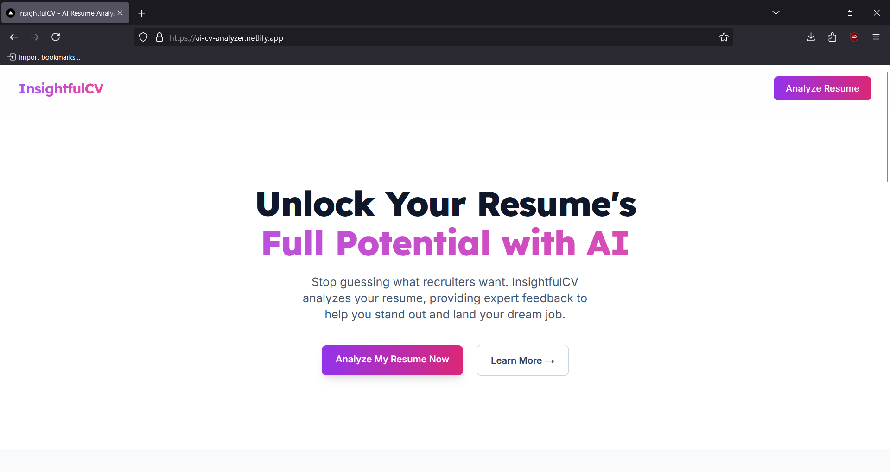

# 🧠 AI Resume Analyzer

A modern full-stack web application that allows users to upload their resume (PDF/DOCX), optionally paste a job description, and receive instant AI-powered analysis. It provides insights into key skills, job fit, ATS score, formatting suggestions, and keyword alignment with job requirements.

<p align="center">
  
</p>

<p align="center">
  
  
  
  
  
</p>

## 🌟 Features

- **Instant AI Analysis**: Get comprehensive feedback on your resume content, structure, and ATS compatibility within seconds
- **Keyword Optimization**: Identify crucial keywords and ensure your resume aligns perfectly with job descriptions
- **Actionable Insights**: Receive clear, practical suggestions to improve your resume and boost your chances
- **ATS Friendliness**: Check how well your resume performs with Applicant Tracking Systems
- **Job Description Matching**: Compare your resume against specific job descriptions for better alignment
- **Modern UI/UX**: Beautiful, responsive interface with dark mode support
- **Secure Storage**: Resume data stored securely using Supabase
- **AI-Powered Analysis**: Leveraging Mistral AI for intelligent resume analysis

## 🛠️ Tech Stack

### Frontend
- Next.js 13 (App Router)
- TypeScript
- TailwindCSS
- Heroicons
- React Hooks
- Netlify Deployment

### Backend
- Node.js
- Express.js
- Mistral AI (via OpenRouter)
- Supabase for data storage
- CORS enabled
- Render Deployment

## 📋 Prerequisites

- Node.js (v16 or higher)
- npm or yarn
- OpenRouter API key
- Supabase account
- PDF parsing library

## 🔧 Installation

1. Clone the repository:
```bash
git clone https://github.com/priyanka-a/ai-resume-analyzer.git
cd ai-resume-analyzer
```

2. Install frontend dependencies:
```bash
cd frontend
npm install
npm npm install cors
```

3. Install backend dependencies:
```bash
cd ../backend
npm install
npm install cors
```

4. Set up environment variables:

Frontend (.env.local):
```env
NEXT_PUBLIC_BACKEND_URL=http://localhost:3001
NEXT_PUBLIC_API_URL=your_pulic_api_url

NEXT_PUBLIC_SUPABASE_URL=your_supabase_url
```

Backend (.env):
```env
PORT=3001
SUPABASE_URL=your_supabase_url
SUPABASE_SERVICE_KEY=your_supabase_service_key
OPENROUTER_API_KEY=your_openrouter_api_key
OPENROUTER_MODEL_NAME=mistralai/mistral-7b-instruct:free
```

## 🚀 Running the Application

1. Start the backend server:
```bash
cd backend
npm run dev
```

2. Start the frontend development server:
```bash
cd frontend
npm run dev
```

3. Open [http://localhost:3000](http://localhost:3000) in your browser

## 📝 Usage

1. Upload your resume (PDF, DOC, or DOCX format)
2. Optionally, paste a job description for targeted analysis
3. Click "Get My AI Analysis"
4. Review the comprehensive feedback:
   - Overall impression
   - Key strengths
   - Areas for improvement
   - ATS compatibility score
   - Keyword matching
   - Formatting suggestions

## 🔒 Security

- File size limit: 10MB
- Supported file types: PDF, DOC, DOCX
- Secure file handling with Supabase
- Environment variable protection
- CORS configuration
- API key security
- Service role authentication

## 🚀 Deployment

The application is deployed on:
- Frontend: [Netlify](https://ai-cv-analyzer.netlify.app/)
- Backend: [Render](https://ai-resume-analyzer-backend-juyi.onrender.com)

## 🤝 Contributing

Contributions are welcome! Please feel free to submit a Pull Request.

1. Fork the repository
2. Create your feature branch (`git checkout -b feature/AmazingFeature`)
3. Commit your changes (`git commit -m 'Add some AmazingFeature'`)
4. Push to the branch (`git push origin feature/AmazingFeature`)
5. Open a Pull Request

## 📄 License

This project is licensed under the MIT License - see the [LICENSE](LICENSE) file for details.

## 👩‍💻 Author

Priyanka A
- GitHub: [[@Navanith_Krishna_R](https://github.com/Navanith-Krishna-R/Ai_Resume_Analyzer.git)
  
## 🙏 Acknowledgments

- Mistral AI for providing the AI capabilities
- OpenRouter for API access
- Next.js team for the amazing framework
- TailwindCSS for the utility-first CSS framework
- Supabase for secure data storage


## 📞 Support

If you have any questions or need help, please open an issue in the GitHub repository.
or mail me at Navanithkrishna2003@gmail.com
---

Made By Navanith Krishna R
